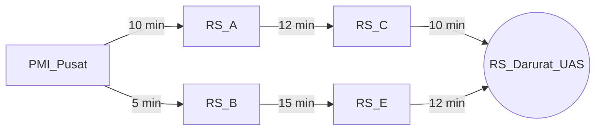

# SmartCare Logistics: Enterprise AI Copilot Optimasi Rute Distribusi Obat & Darah Darurat

Sistem purwarupa cerdas berbasis *State-Space Search* (Uniform Cost Search & A* Search) untuk penentuan alur pengiriman dan distribusi obat serta kantong darah darurat antar-fasilitas kesehatan.

---

## 👥 Anggota Kelompok & Pembagian Peran

* **Kelompok**: [Isi Kode Kelompok, Contoh: Grup 06]
* **Anggota Tim**:
  * **[Kelvin Yohanes Putra]** - *AI Architect & Model Lead*
  * **[Amelia L.Batu]** - *Data & Integration Engineer*
  * **[Nikah Suchia Panjaitan]** - *QA, Evaluation & Ethics Lead*

---

## 📌 Problem Framing & Bisnis

* **Domain Bisnis**: Logistik Rantai Pasok Kesehatan Enterprise (*Time-Critical Medical Supply Chain Logistics*).
* **Pain Points Utama**:
  1. Risiko keterlambatan pengiriman sampel darah atau obat esensial yang berdampak langsung pada keselamatan jiwa pasien.
  2. Kondisi kemacetan lalu lintas perkotaan yang tidak dapat diprediksi secara manual oleh pengemudi armada logistik.
  3. Sampel biologis dan kantong darah memiliki batas waktu ketahanan suhu (*shelf life*) saat ditranspor di luar fasilitas pendingin sentral.
* **Justifikasi Solusi AI**: Penerapan algoritma pencarian ruang keadaan (*State-Space Search*) berbasis **Uniform Cost Search (UCS)** dan **A* Search** memungkinkan kalkulasi rute distribusi terpendek dengan akumulasi waktu tempuh paling minimal secara presisi dan deterministik.

---

## 🎯 Spesifikasi Formal Agen PEAS

* **P (Performance Measure)**: Minimasi waktu tempuh pengiriman (< 20 menit), minimasi total akumulasi jarak/biaya operasional, dan ketepatan waktu pengiriman 100%.
* **E (Environment)**: Jaringan rute jalan antar-Fasilitas Kesehatan (Bank Darah Sentral $\rightarrow$ Rumah Sakit Tujuan), titik persimpangan jalan, dan kondisi tingkat kemacetan.
* **A (Actuators)**: Panel instruksi navigasi rute otomatis pada dasbor pengemudi armada medis.
* **S (Sensors)**: Sensor koordinat GPS kendaraan, sensor pemantau suhu boks medis, dan data masukan API pemantau jarak/kondisi jalan.

### Karakteristik Lingkungan Operasional
* **Partially Observable**: Agen tidak memprediksi kemacetan mendadak secara mutlak sebelum melaluinya.
* **Stochastic**: Waktu tempuh aktual dapat berubah akibat dinamika lalu lintas dan cuaca.
* **Dynamic**: Kondisi kepadatan jalan terus berubah seiring berjalannya waktu.
* **Discrete**: Jaringan lokasi dipetakan secara formal ke dalam ruang keadaan berhingga (*nodes* dan *edges*).

---

## 🧮 Formulasi Ruang Keadaan Matematika $(X, A, T, G, C)$

* **State Space ($X$)**: Set lokasi fasilitas medis $\{ \text{PMI\_Pusat}, \text{RS\_A}, \text{RS\_B}, \text{RS\_C}, \text{RS\_D}, \text{RS\_E}, \text{RS\_Darurat\_UAS} \}$.
* **Actions ($A$)**: Opsi perpindahan jalan dari lokasi $x_i$ ke lokasi tetangga $x_j$.
* **Transition Model ($T$)**: $T(x_i, a) = x_j$.
* **Goal Test ($G$)**: Agen mencapai lokasi rumah sakit tujuan darurat (`RS_Darurat_UAS`).
* **Path Cost ($C$)**: Akumulasi total waktu tempuh perjalanan $\sum \text{weight}(e)$.

---

### 📊 Visualisasi Graf Ruang Keadaan



## 📂 Struktur Repositori

```text
CERTAN-Milestone/
├── .venv/                  # Virtual Environment (Astral uv)
├── src/
│   └── main.py             # Skrip utama algoritma A* & UCS
├── tests/
│   └── test_search.py      # Pengujian unit otomatis (pytest)
├── .gitignore
├── .python-version
├── pyproject.toml          # Manajer dependensi Astral uv
├── README.md               # Dokumentasi utama proyek
└── uv.lock